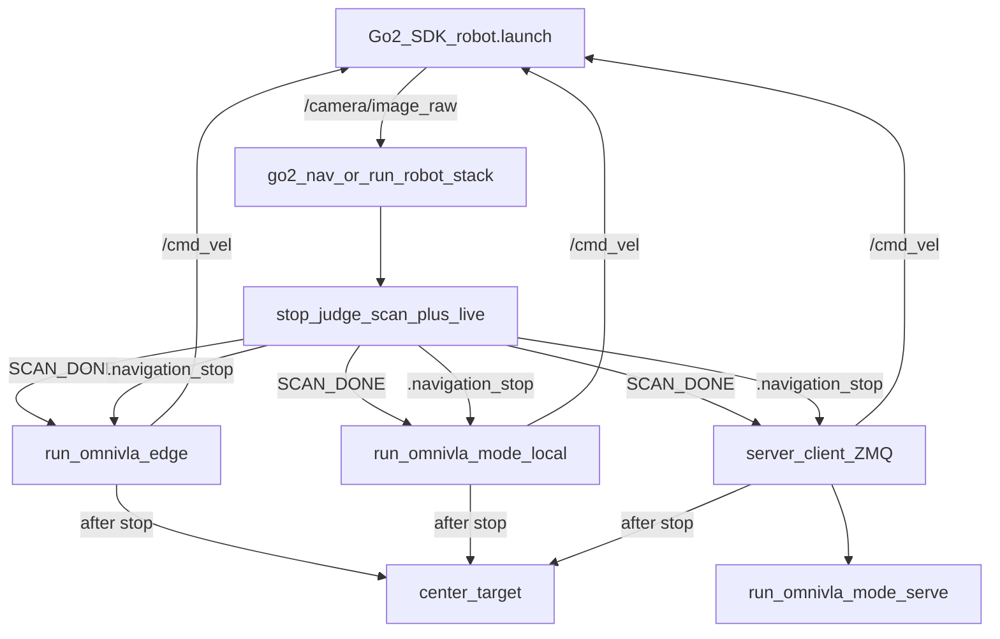

# Go2 stop-judge + OmniVLA stack

Canonical guide for running the real Go2 with a live stop judge and OmniVLA
navigation. Everyday use is the interactive CLI:

```bash
cd goal_stop_judge
python go2_nav.py
```

Isaac Sim notes and other folders under the outer `/workspace` tree are separate;
this README is the stack entry point.

## Clone this umbrella

```bash
git clone --recurse-submodules https://github.com/tom05919/EdgeJudge.git
cd EdgeJudge
# or after a plain clone:
# git submodule update --init --recursive
```

Submodules are **pinned to exact commits** (see `.gitmodules` / `git submodule status`).
Upstream `main`/`master` moving later does not change your tree until you bump the pins.

Layout after clone: `goal_stop_judge/`, `omni-VLA/` (repo root), `unofficial_sdk_unitree_go_2/src/` (single `src/`).

UniDepth, Grounded-SAM-2, and model weights are **not** EdgeJudge submodules — clone them
separately per [`goal_stop_judge/envs/VERSIONS.md`](goal_stop_judge/envs/VERSIONS.md).

---

## 1. Repo layout

From the directory that holds the three project trees (this `workspace/` folder):

| Path | Role |
|------|------|
| `goal_stop_judge/` | Orchestrator, stop judge, scan, ZMQ client, env manifests |
| `omni-VLA/` | OmniVLA-edge and full OmniVLA inference |
| `unofficial_sdk_unitree_go_2/` | Go2 ROS 2 driver (colcon workspace under `src/`) |

Ignore `real_robot_SDKs/unitree_ros2/` and `Go2_Isaac_ros2/` unless you are
working on simulation integration. `goal_stop_judge/VLM_implementation/` is
experimental and is **not** used by `go2_nav.py` / `run_robot_stack.py`.

Pinned SHAs, weight revisions, and clone commands live in
[`goal_stop_judge/envs/VERSIONS.md`](goal_stop_judge/envs/VERSIONS.md).

## 2. Architecture



| Piece | Path | Conda env |
|-------|------|-----------|
| Go2 driver | `unofficial_sdk_unitree_go_2` | `sim` |
| CLI / orchestrator | `goal_stop_judge/go2_nav.py` → `run_robot_stack` | any (spawns children) |
| Perception + scan | `stop_judge.py` (`--scan-first --live`) | `perception` |
| Nav **edge** | `run_omnivla_edge.py` | `sim` |
| Nav **full local** | `run_omnivla.py --mode local` | `omnivla` |
| Nav **full remote** | `server_client.py` ↔ `run_omnivla.py --mode serve` | `perception` ↔ `omnivla` |

**ROS topics (real robot):**

- Camera: `/camera/image_raw`
- Stack publishes: `/cmd_vel` → `twist_mux` → `/cmd_vel_out` → driver → robot
- Stop latch: `goal_stop_judge/.navigation_stop` (distance + optional center offset)

**Three equal navigation choices** (wizard / `--nav`):

1. **edge** — OmniVLA-edge on this PC (`sim`)
2. **full** — full OmniVLA on this PC (`omnivla`, `--mode local`)
3. **remote** — full OmniVLA via ZeroMQ (`perception` client ↔ `omnivla` serve)

Remote is an optional deployment when the desktop GPU is too small — not “the only
way to run full OmniVLA.”

## 3. One-time setup

### 3.1 Clone at pinned revisions

Follow [`goal_stop_judge/envs/VERSIONS.md`](goal_stop_judge/envs/VERSIONS.md) for
clone + checkout commands (stack, OmniVLA, Go2 SDK, UniDepth, Grounded-SAM-2,
and Hugging Face weight trees).

### 3.2 Create conda environments

Manifests and installers live under **`goal_stop_judge/envs/`** (tracked with the
stack repo). Override the conda root with `GO2_CONDA_BASE` if needed.

```bash
# Optional: export GO2_CONDA_BASE=/path/to/miniforge3
cd goal_stop_judge
bash envs/install_sim_env.sh
bash envs/install_perception_env.sh
bash envs/install_omnivla_env.sh   # needed for --nav full or GPU-host serve
```

| Env | Python | Used for |
|-----|--------|----------|
| `sim` | 3.11 | Go2 driver + OmniVLA-edge |
| `perception` | 3.11 | Stop judge, scan, ZMQ client |
| `omnivla` | 3.11 | Full OmniVLA local or serve |

**Do not** mix packages across these envs. **Do not** source `/opt/ros` together
with RoboStack — ROS comes only from the conda env.

After RoboStack install, the scripts re-pin NumPy correctly per env
(`perception` → 2.2.x, `omnivla` → 1.26.x). Re-run the matching `install_*_env.sh
--update` if you install extra ROS packages by hand.

### 3.3 Weights and checkpoints

See `envs/VERSIONS.md` for revisions. Typical needs:

- Edge: `omni-VLA/omnivla-edge`
- Full original (**current code default** in `InferenceConfig`):
  `omnivla-original`, `resume_step=120000`
- Full CAST (swap in `InferenceConfig`): `omnivla-finetuned-cast`,
  `resume_step=210000`
- SAM2: `sam2.1_hiera_small.pt` under Grounded-SAM-2 `checkpoints/`
- HF caches: Grounding DINO + UniDepth (downloaded on first run)

### 3.4 Build the Go2 SDK

```bash
conda activate sim
cd unofficial_sdk_unitree_go_2
colcon build --symlink-install
```

Details and traps: [`RUNNING_GO2_SDK.md`](unofficial_sdk_unitree_go_2/RUNNING_GO2_SDK.md).

## 4. Every session (primary)

### Terminal 1 — Go2 driver (`sim`)

```bash
conda activate sim
cd unofficial_sdk_unitree_go_2
source install/setup.bash
export ROBOT_IP="192.168.x.x"   # your robot IP
ros2 launch go2_robot_sdk robot.launch.py nav2:=false slam:=false joystick:=false
```

Keep `teleop:=true` (default) so `twist_mux` forwards `/cmd_vel` → `/cmd_vel_out`.

### Terminal 2 — stack wizard

```bash
cd goal_stop_judge
python go2_nav.py
```

Answer the prompts: SAM2 detect string, OmniVLA language goal, navigation mode
(`edge` / `full` / `remote`), platform (real Go2 / Isaac Sim). For **remote**,
the wizard asks for the GPU host endpoint — use
`tcp://<gpu-host-ip>:5555` (e.g. `tcp://195.251.89.102:5555`), not `localhost`
unless the server is on the same machine.

Flow: 360° scan + live stop judge → navigation → on stop, optional
`center_target` in `sim`.

### Remote mode — GPU host first

The GPU desktop does **not** need `go2_nav`. Start the full OmniVLA ZeroMQ
server from the OmniVLA tree (`omnivla` env):

```bash
cd omni-VLA
python inference/run_omnivla.py --mode serve --bind tcp://*:5555
# --serve still works as a deprecated alias for --mode serve
```

Bind `tcp://*:5555` on the GPU host. On the robot, point at that host’s IP
(e.g. `tcp://195.251.89.102:5555`). The live language prompt is sent by the
robot client on each ZeroMQ request.

Then on the robot PC, choose **remote** in the wizard (or
`go2_nav.py run --nav remote --endpoint tcp://195.251.89.102:5555`).

If this stack repo is also present on the GPU machine, `python go2_nav.py serve`
is an optional wrapper around the same `run_omnivla.py --mode serve` call.

## 5. Advanced / non-interactive

```bash
cd goal_stop_judge

python go2_nav.py run --sam "fire extinguisher." --vla "go to fire extinguisher" --nav edge
python go2_nav.py run --sam "..." --vla "..." --nav full
python go2_nav.py run --sam "..." --vla "..." --nav remote --endpoint tcp://195.251.89.102:5555

# Optional knobs (defaults are fine for normal use)
python go2_nav.py run --nav edge --stop-distance 1.0 --min-interval 1.0 --cmd-vel-topic /cmd_vel
python go2_nav.py run --nav edge --sim   # Isaac Sim topic names

# Power-user path (same stack; --text-prompt is the SAM alias for --sam)
python run_robot_stack.py --navigation remote \
  --server-endpoint tcp://195.251.89.102:5555 --text-prompt "Human."
```

Prefer `go2_nav.py` day-to-day. `run_robot_stack.py` is the library + slim flags;
`--text-prompt` there is SAM (same as `--sam`); OmniVLA language is `--vla`.

## 6. Config knobs

| Knob | Where | Notes |
|------|--------|------|
| SAM2 detect prompt | wizard / `--sam` (`run_robot_stack --text-prompt` alias) | Passed to stop judge as `--text-prompt` |
| OmniVLA language | wizard / `--vla` | Passed to edge / full / remote as `--text-prompt` |
| `--stop-distance` | `go2_nav run` | Default 1.0 m |
| `--min-interval` | `go2_nav run` | Min seconds between stop evaluations |
| Velocity clamps | `server_client.py` | `MAX_LINEAR=0.3`, `MAX_ANGULAR=0.4` (remote path) |
| Checkpoint / resume | `InferenceConfig` in `run_omnivla.py` | Default original/`120000`; CAST/`210000` optional — see VERSIONS.md |
| Conda root | `GO2_CONDA_BASE` | Portable; no hardcoded `/root/miniforge3` |
| Torch wheel index | `GO2_TORCH_INDEX_URL` | Override CUDA pip index in install scripts |

There is no angular-sign-flip CLI flag. Hard stop: `Ctrl+C` on the driver and
stack terminals (and Enter failsafe where the controller exposes it).

## 7. Troubleshooting

| Symptom | What to try |
|---------|-------------|
| `go2_nav.py --help` fails importing ROS | Fixed in current tree (`center_target` is lazy-imported); CLI must not need `rclpy`. |
| Stop judge never becomes ready / nav never starts | Models still loading, or child crashed. Stack waits for **`SCAN_DONE`** then starts OmniVLA while UniDepth loads. |
| No camera / no motion | Driver up? `ros2 topic hz /camera/image_raw`; `twist_mux` running (`teleop:=true`); see REAL_ROBOT §9. |
| Remote ZMQ timeouts / no frames on server | GPU host serving? Firewall open on 5555? Robot `--endpoint` must be `tcp://<gpu-host-ip>:5555`, not `localhost`/`HOST`. |
| NumPy / ROS import fights | Re-run the env’s `install_*_env.sh --update`; never force one NumPy pin across all three envs. |
| VRAM OOM on full local | Use `--nav edge`, or `--nav remote` with `run_omnivla.py --mode serve` on a larger GPU. |
| Env recreate | `bash envs/install_<name>_env.sh --remove` then install again (needs disk for CUDA wheels). |
| Mixing system ROS | Do not `source /opt/ros/...` in RoboStack shells. |

More driver / topic detail:
[`REAL_ROBOT_GO2.md`](omni-VLA/REAL_ROBOT_GO2.md) (edge-era guide — prefer this README for the full stack),
[`RUNNING_GO2_SDK.md`](unofficial_sdk_unitree_go_2/RUNNING_GO2_SDK.md),
[`SETUP.md`](omni-VLA/SETUP.md) (upstream OmniVLA pins; stack installers supersede for this workspace).

## 8. Pointers

| Doc | Use |
|-----|-----|
| [`goal_stop_judge/envs/VERSIONS.md`](goal_stop_judge/envs/VERSIONS.md) | SHAs, weights, env summary |
| [`goal_stop_judge/envs/`](goal_stop_judge/envs/) | `environment-*.yml`, `requirements-*.txt`, `install_*_env.sh` |
| [`omni-VLA/REAL_ROBOT_GO2.md`](omni-VLA/REAL_ROBOT_GO2.md) | Driver topics, launch flags, hardware traps |
| [`unofficial_sdk_unitree_go_2/RUNNING_GO2_SDK.md`](unofficial_sdk_unitree_go_2/RUNNING_GO2_SDK.md) | colcon build / RoboStack SDK |
| [`omni-VLA/SETUP.md`](omni-VLA/SETUP.md) | Upstream full-model setup notes |
| `goal_stop_judge/VLM_implementation/` | Experimental; out of scope for this stack |
