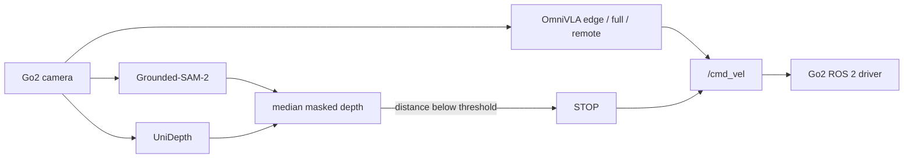

# EdgeJudge: A Lightweight Goal-Completion Judge for Vision-Language Navigation

[](https://www.python.org)
[](LICENSE)
[](https://arxiv.org/abs/2509.19480)
[](https://omnivla-nav.github.io)

[Tom Wang](https://github.com/tom05919)<sup>1</sup>

<sup>1</sup> Princeton University (Electrical and Computer Engineering)

EdgeJudge is a lightweight **goal-completion judge** for language-conditioned
robot navigation. Two frozen perception models decide when the task is done:
[Grounded-SAM-2](https://github.com/IDEA-Research/Grounded-SAM-2) localizes the
object named in a text prompt, and [UniDepth](https://github.com/lpiccinelli-eth/UniDepth)
estimates metric depth on that mask. Navigation stops when the median masked
range falls below a threshold (default 1 m). The policy is
[OmniVLA](https://omnivla-nav.github.io/) (edge, full, or remote) on a Unitree
Go2.



## Quickstart (no robot)

Needs [Miniforge](https://github.com/conda-forge/miniforge), Git, Git LFS, and a
CUDA GPU for the perception / edge weights.

```bash
git clone --recurse-submodules https://github.com/tom05919/EdgeJudge.git
cd EdgeJudge
cp .env.example .env          # ROBOT_IP is only required for Track B
make setup                    # code deps + sim + perception + SDK
make weights                  # OmniVLA-edge + SAM2 + HF perception caches
make smoke                    # stop_judge on examples/sample.png
```

`make smoke` must print detections / `should_stop` and write visualizations under
`examples/smoke_output/`. It does **not** start ROS. Details and flags:
[SETUP.md](SETUP.md). Pins: [VERSIONS.md](VERSIONS.md).

## Track A — Offline inference

The judge already runs on a single image (no `--live`):

```bash
make smoke
# equivalent:
# conda activate perception
# python goal_stop_judge/stop_judge.py \
#   --image examples/sample.png --text-prompt "red cube."
```

Optional OmniVLA-edge CLI check (still no robot):

```bash
make smoke-edge
```

Sample image notes: [examples/README.md](examples/README.md).

## Track B — Real Unitree Go2

After Track A works, bring up the driver and the stack wizard. Full command
sequence: [docs/real_robot.md](docs/real_robot.md).

```bash
# terminal 1 — driver (set ROBOT_IP in .env)
make driver

# terminal 2 — interactive wizard (start with nav mode "edge")
make nav
```

Non-interactive (quotes in Make `NAV_ARGS` do not survive; call the script):

```bash
./scripts/nav.sh run --sam "Human." --vla "go to the human with white shirt" --nav edge
```

| Mode | Where the model runs | Extra setup |
|------|----------------------|-------------|
| `edge` (default) | This PC, `sim` env | `make weights` |
| `full` | This PC, `omnivla` env | `make setup-full` and `make weights-full` |
| `remote` | GPU host via ZeroMQ | [docs/remote.md](docs/remote.md) |

Isaac Sim uses the same CLI with `--sim`. Docker driver alternative:
[docker/README.md](docker/README.md).

## Repository layout

| Path | Role |
|------|------|
| `goal_stop_judge/` | Stop judge, scan, ZMQ client, conda install scripts |
| `omni-VLA/` | OmniVLA-edge and full OmniVLA inference |
| `unofficial_sdk_unitree_go_2/` | Go2 ROS 2 driver (colcon workspace) |
| `scripts/` | `bootstrap.sh`, `download_weights.sh`, `smoke_test.sh` |
| `examples/` | Bundled smoke-test frame |
| `docker/` | Optional Dockerfiles (not a pre-built image) |

`goal_stop_judge/VLM_implementation/` is experimental and is **not** used by
`go2_nav.py`.

## Docs

| Doc | Use |
|-----|-----|
| [SETUP.md](SETUP.md) | `make setup` flags, three envs, CUDA, Git LFS |
| [VERSIONS.md](VERSIONS.md) | Pinned SHAs and weights |
| [docs/real_robot.md](docs/real_robot.md) | Driver + `go2_nav.py` |
| [docs/remote.md](docs/remote.md) | GPU-host ZeroMQ serve |
| [docs/troubleshooting.md](docs/troubleshooting.md) | Common failures |
| [docker/README.md](docker/README.md) | Optional Compose driver / dev shell |
| [RUNNING_GO2_SDK.md](unofficial_sdk_unitree_go_2/RUNNING_GO2_SDK.md) | colcon / RoboStack SDK |

## Acknowledgements

EdgeJudge composes pretrained models rather than training a new policy. We thank
the authors of [OmniVLA](https://github.com/NHirose/OmniVLA) (built on
[OpenVLA-OFT](https://openvla-oft.github.io/)),
[Grounded-SAM-2](https://github.com/IDEA-Research/Grounded-SAM-2),
[UniDepth](https://github.com/lpiccinelli-eth/UniDepth), and
[go2_ros2_sdk](https://github.com/abizovnuralem/go2_ros2_sdk). Third-party trees
keep their own licenses; this umbrella (docs, scripts, Dockerfiles) is MIT.

## Citing

Please cite OmniVLA if you use this stack:

```bibtex
@misc{hirose2025omnivla,
      title={OmniVLA: An Omni-Modal Vision-Language-Action Model for Robot Navigation},
      author={Noriaki Hirose and Catherine Glossop and Dhruv Shah and Sergey Levine},
      year={2025},
      eprint={2509.19480},
      archivePrefix={arXiv},
      primaryClass={cs.RO},
      url={https://arxiv.org/abs/2509.19480},
}
```

If you use EdgeJudge itself, please also cite this repository:

```bibtex
@software{edgejudge2026,
  title  = {EdgeJudge: A Lightweight Goal-Completion Judge for Vision-Language Navigation},
  author = {Wang, Tom},
  year   = {2026},
  url    = {https://github.com/tom05919/EdgeJudge},
}
```
